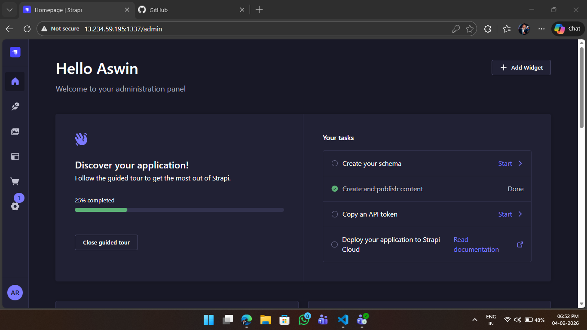

## EC2 provisioning using terraform and setting up Strapi on EC2

This repo provisions an AWS EC2 instance with Terraform using a module structure, generates a managed `.pem` key file, and runs Strapi on the instance.

**Task requirements covered**
1. Provision EC2 and create a `.pem` via Terraform (managed in state).
2. Run Strapi on the EC2 instance.
3. Use module structure for Terraform.
4. Create a git repo and raise a PR.
5. Submit task progress in the submission channel.

---

## Screenshot



---

**Architecture Summary**
- `modules/key_pair` generates an RSA key, creates an AWS key pair, and writes `strapi-key.pem`.
- `modules/security_group` creates a security group with:
  - SSH (22) restricted to `my_public_ip` (CIDR /32)
  - Strapi (1337) open to the internet
- `modules/ec2` launches a Ubuntu 22.04 (Jammy) EC2 instance and attaches the SG and key.

---

**Prerequisites**
- Terraform >= 1.3
- AWS credentials configured in your environment (e.g., AWS CLI)
- An AWS region (default: `ap-south-1`)
- Your public IP in `/32` format for SSH access

---

**Repo Structure**
- `main.tf` — root module wiring
- `variables.tf` — root inputs
- `outputs.tf` — root outputs
- `provider.tf` — Terraform and provider config
- `terraform.tfvars` — user-specific values
- `modules/key_pair` — key creation and local `.pem` output
- `modules/security_group` — SG rules for SSH + Strapi
- `modules/ec2` — EC2 instance

---

**Configuration**
Update `terraform.tfvars`:
```hcl
instance_type = "t2.medium"
my_public_ip  = "YOUR_PUBLIC_IP/32"
```

---

**Provisioning**
1. Initialize Terraform:
```bash
terraform init
```
2. Validate and review the plan:
```bash
terraform validate
terraform plan
```
3. Apply:
```bash
terraform apply --auto-approve #to apply automatically without confirmation
```
4. After apply, note outputs:
```bash
terraform output
```
Expected outputs: `public_ip`, `instance_id`, `key_name`, `security_group_id`.

5. Confirm key file exists locally:
- `strapi-key.pem` should be generated in the repo root.

**Security note:** never commit the private key. It is already ignored by `.gitignore`.

---

**Connect to EC2**
Use the output `public_ip`:
```bash
ssh -i strapi-key.pem ubuntu@<PUBLIC_IP>
```

---

**Strapi Setup (Ubuntu 22.04)**
These steps are performed *on the EC2 instance* after SSH.

1. Update packages:
```bash
sudo apt update
sudo apt -y upgrade
```
2. Install Node.js LTS (example uses Node 20):
```bash
curl -fsSL https://deb.nodesource.com/setup_20.x | sudo -E bash -
sudo apt -y install nodejs build-essential
```
3. Verify versions:
```bash
node -v
npm -v
```
4. Create a Strapi app:
```bash
npx create-strapi-app@latest strapi
```
5. Start Strapi and bind to all interfaces:
```bash
cd strapi
npm run develop
```
6. Access Strapi in your browser:
```
http://<PUBLIC_IP>:1337
```

---

**Destroy Resources**
```bash
terraform destroy
```
